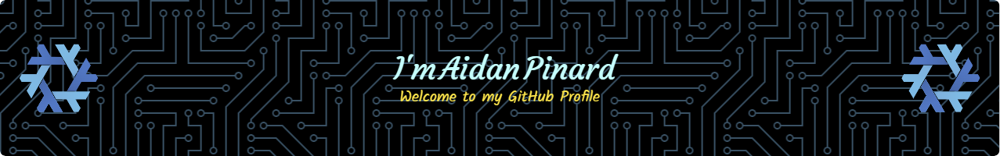

I'm a guy who thinks computers are cool. I'm currently at UWI St. Augustine for a BSc. in Electrical and Computer Engineering.

### Stuff I'm interested in
- Functional Programming
- Tech talks
- Skyrim

### Programming Languages Interests
- [X] JavaScript - First language I started properly learning to code with. Tended to hack around with it a lot.
- [X] C++ - Used it mostly for school assignments. 
- [X] F# - Accidentally happened upon it and learned about the existence of functional programming.
- [X] C# - Started using it at an internship, picked it up super quickly thanks in part to learning F#.
- [X] Powershell - Used it to automate a bunch of stuff when I used Windows. Super easy to script with.
- [ ] Rust - Watched some tech talks about it and got interested. One of my favorite programs, [Czkawka](https://github.com/qarmin/czkawka) is written in Rust.

